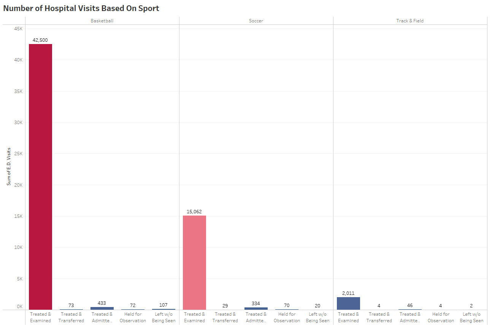
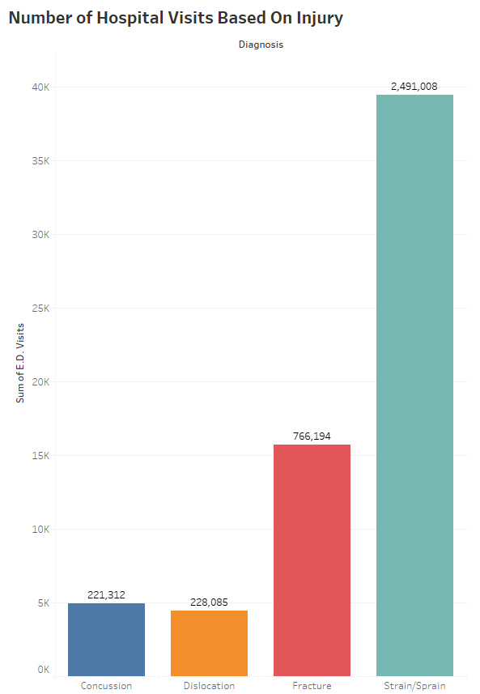
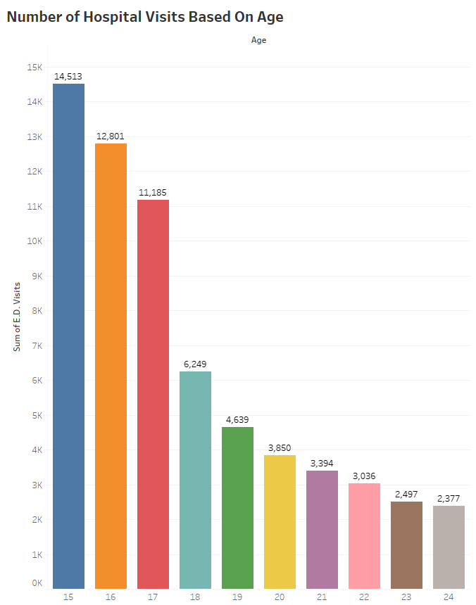
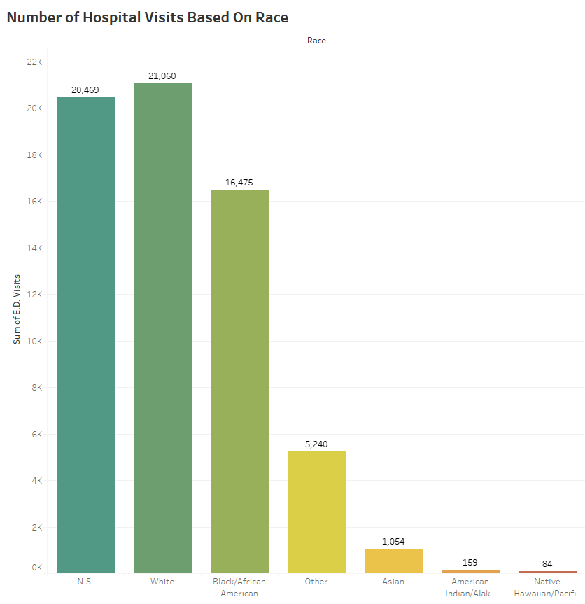
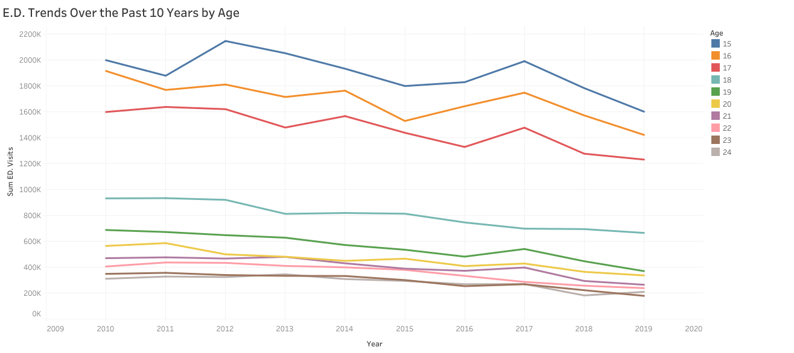
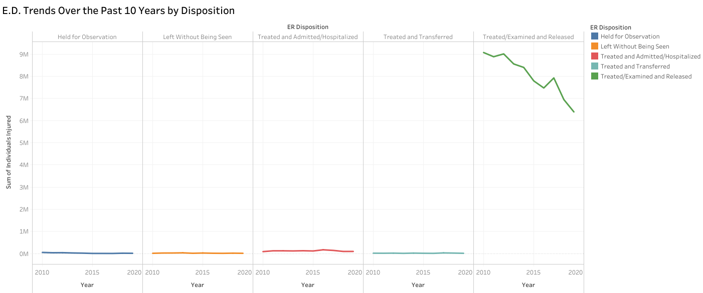
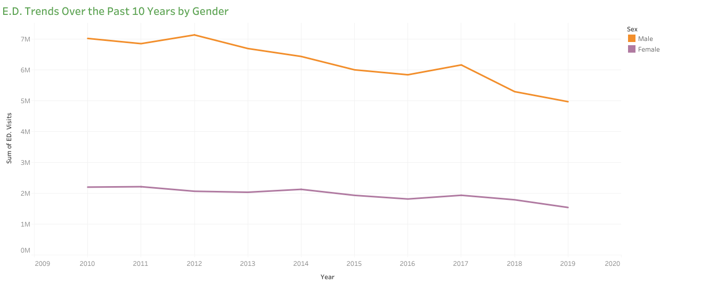
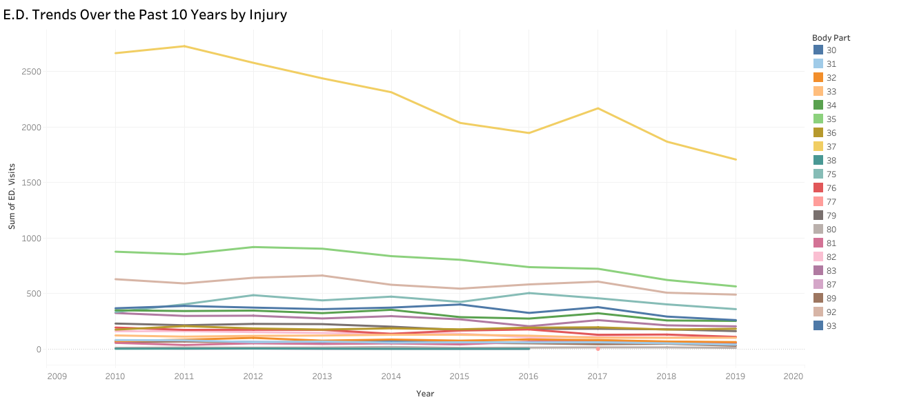
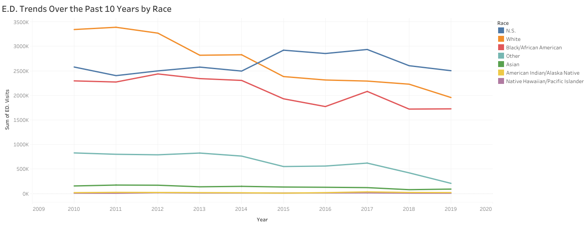
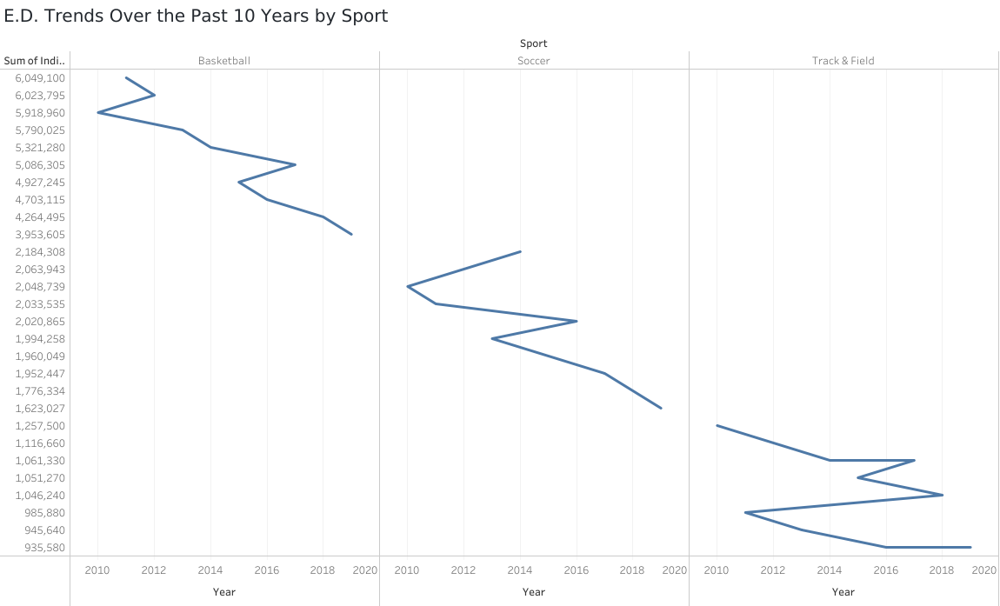

# Emergency Department Youth Sport-Related Injury Analysis
## Overview
According to the Centers for Disease Control and Prevention (CDC), 131.3 million visits to the Emergency Department (E.D.) in 2020, and 38 million trips were injury related. The USA Department of Health and Human Services *2021 Trends in the Utilization of Emergency Department Services between 2009-2018* report aware congress of the misuse of E.D. resources for "non-emergency" or "inappropriate" visits. We hope to support hospitals and optimize healthcare resources by highlighting statistical findings of sport-related injuries for youth patients that would help an alternative injury management plan.

Our target demographic is the youth who visited the E.D. for sport-related injuries over ten years. The World Health Organization and the United Nations define 'youth' as those persons between the ages of 15 and 24. The definition of youth may change with circumstances: demographic, financial, economic, and socio-cultural settings. However, the definition that uses the 15-24 age cohort as youth appropriately describes people who benefit from guidance as they transition from the dependence of childhood to adulthood independence. Our objective is to focus on the most popular sports played by males and females according to the National Federation of State High School Associations: track and field, basketball, and soccer. We are analyzing E.D. visits due to concussions, sprains, fractures, and dislocations at schools, daycares, or recreation sports fields. By studying specific sports and injuries, we hope to find significant statistical findings to guide an injury management plan. We are querying data over ten years from 2009 to 2019 from the National Electronic Injury Surveillance System (NEIISS) Database. 

**Our hypothesis is that most E.D. visits are minors under 18 who had the highest percentage of "non-emergency" or "inappropriate" visits and did not require hospitalization or were not transferred to a different department.** This target audience would benefit from an injury management plan that utilizes other healthcare resources. 

### Technology, Languages, and Tools
- Excel
- Tableau
- Python
- R

#### National Electronic Injury Surveillance System (NEISS) Database
For over 45 years, the CPSC has operated a statistically valid injury surveillance and follow-back system known as the National Electronic Injury Surveillance System (NEISS). The primary purpose of NEISS is to collect data on consumer product-related injuries occurring in the United States. CPSC uses these data to produce nationwide estimates of product-related injuries.
##### Description of Data
NEISS is based on a nationally representative probability sample of U.S. hospitals and territories. Each participating NEISS hospital reports patient information for every emergency department visit associated with a consumer product or a poisoning. They have become an important public health research tool for CPSC, researchers, and consumers throughout the United States and worldwide. In 2000, CPSC expanded NEISS to collect data on all injuries for the Centers for Disease Control and Prevention through an interagency agreement. The next major update to NEISS occurred in 2018 with seven new variables: Diagnosis_2, Other_Diagnosis_2, Body_Part_2, Product_3, Ethnicity, Alcohol_Involved, and Drug_Involved. In addition to the new variables, the maximum length of the Narrative text was increased from 142 to 400 characters. These changes were effective, starting with the treatment date of January 1, 2019.
###### ***Types of Data***
## Analysis
### Visualizations
#### Bar Charts
Quickly identify the highest or the lowest variable, including the incremental differences between bars. 
- Which sport had the most hospital visits? Basketball
- Which injury had the most hospital visits? Strain/Sprain
- Which age had the most hospital visits? Minors from the age 15 had more hospital E.D. visits than the sum of E.D. visits of adults from the age of 18 to 24.
- Which disposition had the most hospital visits? Treated and examined
- Which race had the most hospital visits? The top two races from with the most E.D. visits from 2010 to 2019 were whites then blacks.

#### Line chart
Show trends or progress over time and highlight accelerations and decelerations in data
- What are the trends of total E.D. visits over the past ten years by sport? Basketball had the highest number of E.D. visits. Track and field has the highest deceleration of E.D. visits from 2018-2019.
- What are the trends of total E.D. visits over the past ten years by age? Ages 15, 16, and 17 have the highest rate of deceleration of E.D. visits the from 2018-2019.
- What are the trends of total E.D. visits over the past ten years by injury? Most injuries where caused by and injury ankle followed by knee injuries. Both of the top two injuries E.D. visits are decelerating.
- What are the trends of total E.D. visits over the past ten years by disposition? Overall there is a downward trend in patients being treated, examined, and released. Their seems to be a slight increase in the rate of hospitalzations.
- What are the trends of total E.D. visits over the past ten years by gender? Men visit the E.D. more than women. Over the past 10 yeard there has been an overall decrease in E.D. visits.
- What are the trends of total E.D. visits over the past ten years by race? The difference between whites and blacks E.D. visits is decreasing. 

### Pie chart
Represents data in percentages
- What is the injury percentage by sport

- What was the disposition percentage by sport.

- What was the disposition percentage by gender? 

- What was the disposition percentage by location? 
 

- What was the disposition percentage by body part? 

- What was the disposition percentage by race? 

### R and Machine Learning
#### R
- Statistical Significance of sport-related injury leading to no injury, being left without being seen
- Statistical Significance of sport-related injury being treated/ examined and released
- Statistical Significance of sport-related injury leading to being treated and admitted to hospitalized
- Statistical Significance of sport-related injury leading to death in E.D,

#### Clustering
Supervised machine learning separteing people into categories into high risk and low risk based on age. Create a machine learning model that would predict if someone is high or low risk.

## Summary
If a person could die or be permanently disabled, it is an emergency. For our study, the following are reasons to visit the E.D.:
- Injury to the head with passing out, fainting, or confusion, 
- Injury to neck or spine, particularly if there is loss of feeling or inability to move
- Severe chest pain or pressure
- Seizures
- Trouble breathing, passing out, fainting, 
- Pain in the arm or jaw
- Unusual or bad headache, particularly if it starts suddenly
- Suddenly not able to speak, see, walk, or move, 
- Suddenly weak or drooping on one side of the body
- Dizziness or weakness that does not go away
- Sudden confusion
- Heavy bleeding
- Possible broken bone, loss of movement, particularly if the bone is pushing through the skin
- Deep wound
- Coughing or throwing up blood
- Severe pain anywhere on the body
- High fever with headache and stiff neck
- High fever that does not get better with medicine
- Throwing up or loose stools that do not stop
### Injury Management Plan

#### Strength
#### Limitations
We are not medical professionals that can determine which injuries are deemed "inappropriate" or "non-emergency."
#### Future Finding
1) Does weight/BMI play a role in disposition
2) Who brought the patient into the hospital
3) Medical Education of patient and parent
4) Wait time of patients at the hospital

# Project Management
Our team has two departments: Analytical and Data Wrangling and Visualization Team.
#### Analytical Team
The Analytical Team's role is to narrow down the selected topic and determine the reasonings for research proposals. We determine the data source used for our analysis. Our objectives are to use insights uncovered by the visualization team to further our analysis through machine learning models. 
##### Alicia Samuel-Ninou
- Project Research 
- README.md Report
- Jupyter Notebook CSV Files Concat
- README.md Analysis
##### Kailey O'Shaughnessy
- Project Research
- Initial Clean
- Statistical Analysis
- Machine Learning Model
#### Data Wrangling and Visualization Team
The Data Wrangling and Visualization Team's role is to clean data further and determine and create visualizations for our analysis. By answering data-driven questions, we determine what variables were primitive to support or reject our hypothesis. The questions the team planned to respond to with the data will help determine how we will use our machine-learning model.  
##### Alejandro Miranda Miranda
- Wrangle Data
- Pie Chart Visualization
##### Edward Yi
- Bar Chart Visualization
##### Zenat
- Wrangle Data
- Line Graph Visualization
- 
 
## Data Exploration Phase
The first step of our exploration phase is determining critical variables influencing our hypotheses and uncovering insights into sport-related injuries based on age, gender, disposition, and location. Next, we will identify areas or patterns for our machine-learning model with bar graphs, line graphs, and pie charts. Then, using interactive dashboards that filter data by sport, our audience can be able to understand our data-driven story.

## Data Analysis Phase
Data Analysis systematically applies statistical and logical techniques to describe, illustrate, condense, recap, and evaluate data.

## Time Management Outline
- 2/27: Determine the research topic and sub-groups
- 2/28: Research the research topic and determine the data and direction of the project
- 2/29: Update group on the research topic and direction of the project
- 3/1: Finalized Youth Injury Analysis
- 3/6: Updates on project, designated visualization tasks, Master NEISS csv
- 3/8: Edited, uploaded, discussed visualizations, discussed next meet up time
- 3/13: Edited graphs, 
- 3/15: Finalize our story and pick top graphs to represent our story
